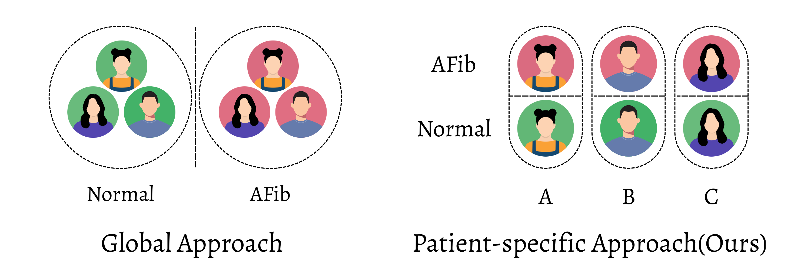

# PACL-RRI-AF
 
**Patient-Aware Contrastive Learning Preserves Per-Patient Structure in RR-Interval Representations**
 


 
> Official Implementation of *Patient-Aware Contrastive Learning Preserves Per-Patient Structure in RR-Interval Representations* — Accepted at [GlobalSouthML: Bridging Gaps for Underrepresented Researchers in Machine Learning](https://sites.google.com/view/globalsouthml-icml-26), ICML 2026 Workshop · July 9, 2026 · Seoul, South Korea.
 
---
 
## Key Results
 
| Metric | Proposed (PACL) | SupCon | BCE |
|---|---|---|---|
| **SR Cohesion ↑** | **0.850 ± 0.044** | 0.800 ± 0.029 | 0.772 ± 0.049 |
| AF Cohesion ↑ | 0.846 ± 0.048 | **0.921 ± 0.035** | 0.955 ± 0.019 |
| Centroid Similarity ↓ | +0.238 ± 0.200 | +0.155 ± 0.123 | **−0.717 ± 0.029** |
| Global Centroid Dist. ↑ | 1.034 ± 0.100 | 1.120 ± 0.095 | **1.603 ± 0.045** |
| Global Compactness ↑ | 1.192 ± 0.124 | 1.313 ± 0.465 | **2.427 ± 0.226** |
| Per-pt. Compactness ↑ | **3.273 ± 0.433** | 2.178 ± 1.148 | 6.396 ± 0.590 |
| **AUROC ↑** | **0.989 ± 0.003** | 0.983 ± 0.009 | 0.980 ± 0.012 |
 
PACL achieves the highest per-patient SR cohesion and **2.6× lower seed variance** than SupCon on a patient-independent test split (frozen encoder + logistic regression probe).
 
### Per-Class Downstream Metrics (Proposed, 5 seeds)
 
| Class | Precision | Recall | F1 |
|---|---|---|---|
| SR | 0.970 ± 0.009 | 0.927 ± 0.020 | 0.948 ± 0.012 |
| AF | 0.936 ± 0.017 | **0.974 ± 0.008** | 0.955 ± 0.010 |
| **Accuracy** | — | — | 0.952 ± 0.011 |
 
---

## The Core Idea
Standard supervised contrastive learning treats all same-class segments as positives, regardless of which patient they come from. When class differences partially overlap with between-patient differences, this collapses each subject's distinct sinus rhythm (SR) baseline into a shared class prototype removing the very structure needed to generalize to unseen patients.
 
**PACL** restricts positives to same-patient, same-class pairs:
 
```
P(i) = { j ≠ i | patient_j == patient_i  AND  class_j == class_i }
N(i) = { j ≠ i | class_j ≠ class_i }
```
 

 
Same-class segments from *different* patients are excluded from P(i). This preserves each patient's individual SR structure while still pushing SR and AF apart.

---

## Installation

```bash
git clone https://github.com/EML-Labs/pacl-rri-af.git
cd pacl-rri-af
pip install -r requirements.txt
```

Requirements: Python 3.9+, PyTorch 2.x, numpy, scikit-learn, hydra

---

## Data

This work uses the [IRIDIA-AF dataset](https://doi.org/10.5281/zenodo.8405941), comprising long-term single-lead ECG recordings from 167 patients with paroxysmal AF. Episodes are retained when AF duration ≥ 1 hr and the immediately preceding SR duration ≥ 4 hr. Splits are patient-level (119/24/24 train/val/test); after quality filtering, 154/27/24 episodes remain.

---

## Quick Start

**Train with the proposed PACL objective:**

```bash
python main.py
```
**Environment:** Single NVIDIA RTX 2080, ~3 minutes per run (5 seeds × 3 losses = 15 runs total).
**Seeds used:** 1, 42, 102, 2026, 9999.
**Exact package versions:** see `requirements.txt`.

---

## Comparison with Prior Work
 
Direct numerical comparison is limited by dataset and evaluation differences.  
† Cross-validation with within-patient data mixing inflates reported metrics.  
‡ MIT-BIH AF contains no episodes satisfying our quality criteria (AF ≥ 1h, preceding SR ≥ 4h).
 
| Study | Method | Dataset | Validation | Sensitivity | Specificity | Accuracy |
|---|---|---|---|---|---|---|
| Udawat & Singh (2022) | HRV + ML | MIT-BIH AF | CV† | 95.16% | 92.46% | 94.43% |
| Andersen et al. (2019) | CNN + RNN | 3 dbs | 5-fold CV† | 98.98% | 96.95% | — |
| Andersen et al. (2019) | CNN + RNN | Unseen Pt. holdout | — | 86.04% | 98.96% | — |
| Faust et al. (2018) | LSTM | MIT-BIH‡ | 10-fold CV† | — | — | 98.51% |
| **Ours** | **CNN + MLP** | **IRIDIA-AF** | **Pt. holdout** | **97.40 ± 0.80%** | **92.72 ± 2.01%** | **95.17 ± 1.07%** |
 
The proposed representations exceed Andersen et al.'s patient-holdout sensitivity by over **11 percentage points** using only a frozen encoder and a logistic regression probe.
 
---

## Generality

The PACL objective does not depend on the encoder or the signal type. It requires only subject identifiers in each mini-batch. The same positive-pair construction is expected to apply to other subject-structured physiological signals — EEG, EMG, PPG — wherever class differences partially overlap with between-subject differences.

---

## Citation

If you find this work useful, please cite:

```bibtex
@inproceedings{niroshan2026pacl,
  title     = {Patient-Aware Contrastive Learning Preserves Per-Patient Structure
               in RR-Interval Representations},
  author    = {Niroshan, Yasantha and Wimalasiri, Wimalasiri and Hettiarachchi, Chathuranga},
  booktitle = {GlobalSouthML: Bridging Gaps for Underrepresented Researchers in Machine Learning,
               ICML 2026 Workshop},
  year      = {2026}
}
```

## License

MIT License. See [LICENSE](LICENSE) for details.